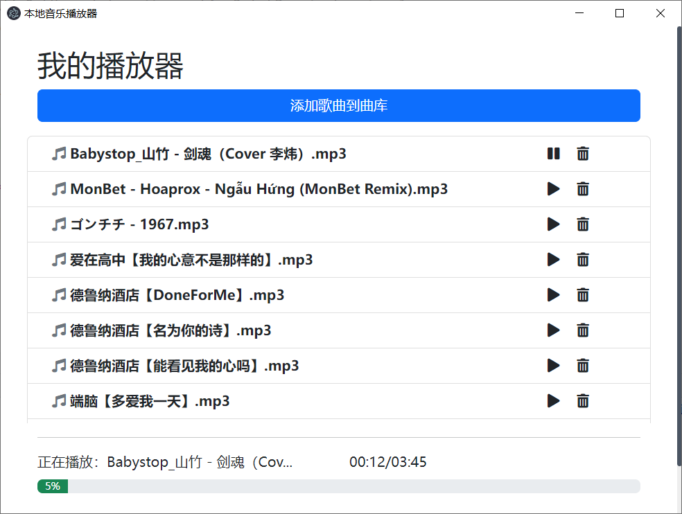
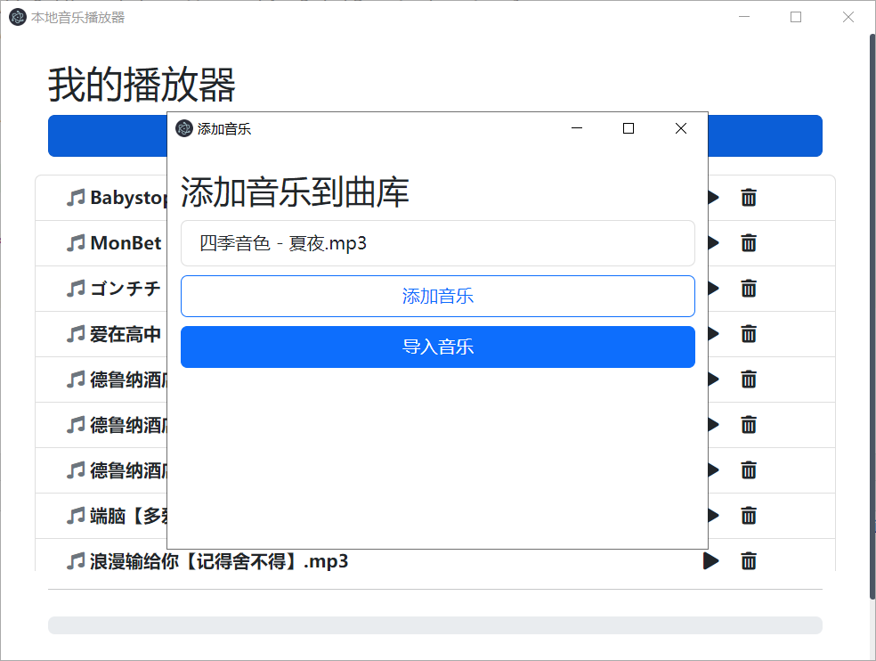

## 项目说明

- 项目名称：简易音乐播放器
- 项目技术：Electron + BootStrap
- 项目运行

```
# 安装依赖
npm install
# 运行项目
npm run start
```

## 项目环境搭建

- 初始化项目

```
# 克隆示例项目
git clone https://github.com/electron/electron-quick-start
git clone git@github.com:electron/electron-quick-start.git
# 进入项目根目录
cd electron-quick-start
# 安装依赖
npm install
```

- 其它依赖

```
# 引入 BootStrap
npm i -S bootstrap
<link rel="stylesheet" href="../node_modules/bootstrap/dist/css/bootstrap.min.css">

# 局部安装 nodemon
npm install --save-dev nodemon
# 配置运行命令
# onlyEle-只监控 main.js 运行
"onlyEle": "nodemon --watch main.js --exec \"electron .\""
# devEle-监控 main.js 和 renderer 文件夹
"devEle": "nodemon --watch main.js --watch renderer/*.* --exec \"electron .\""
```

## 数据持久化

- 安装

```
https://github.com/sindresorhus/electron-store
npm install electron-store
```

- 测试案例

```
const Store = require('electron-store');

function testElectronStore() {
  const store = new Store();

  store.set('unicorn', 'hello');
  console.log(store.get('unicorn')); // hello

  store.set('foo.bar', true);
  console.log(store.get('foo')); // { bar: true }

  store.delete('unicorn');
  console.log(store.get('unicorn')); // undefined
}

testElectronStore()

// 查看数据存储的位置，music-player 对应的 package.json 中的 name 值
// C:\Users\zhangjinquan\AppData\Roaming\music-player
console.log(app.getPath('userData')) // config.json
```

- 数据文件查看


## 项目运行效果

- 首页音乐列表


  
- 添加音乐


